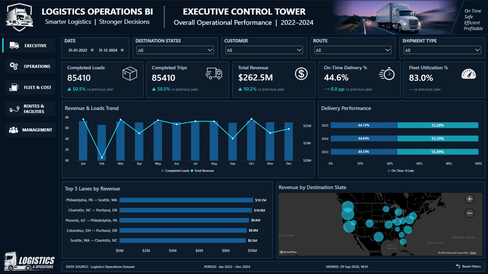
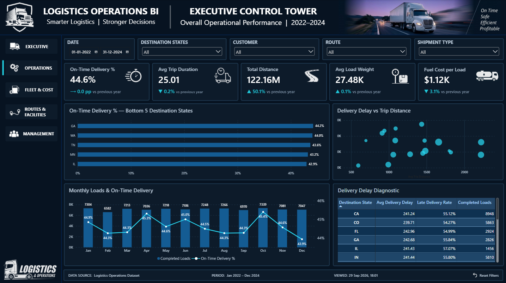
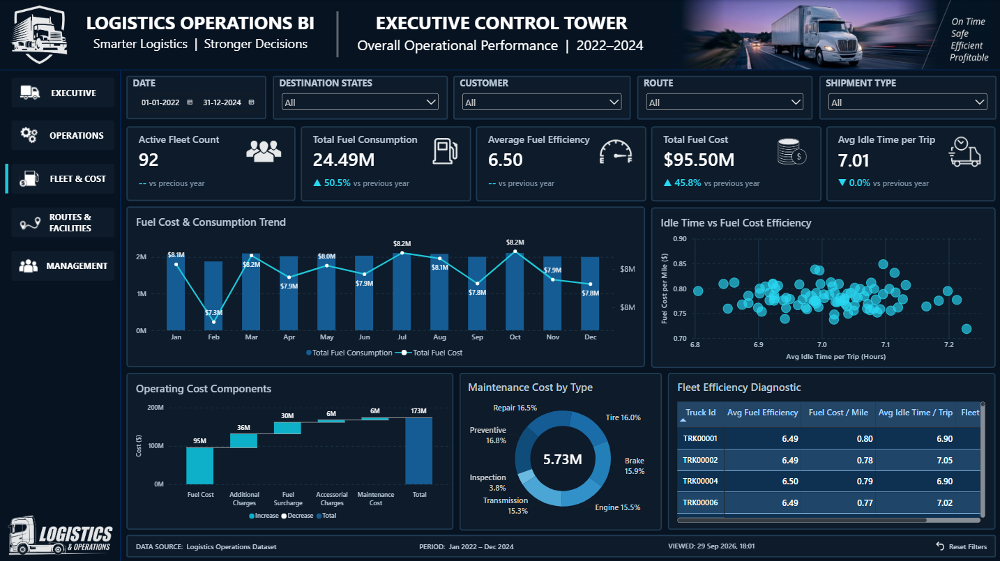
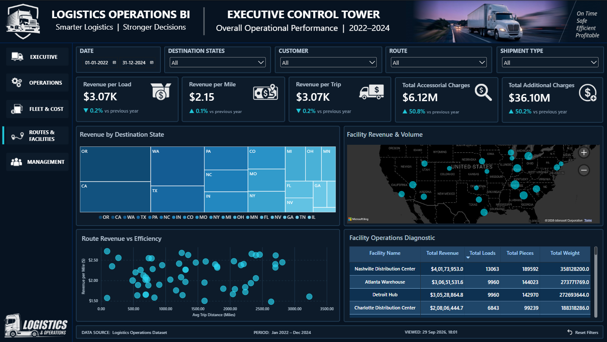
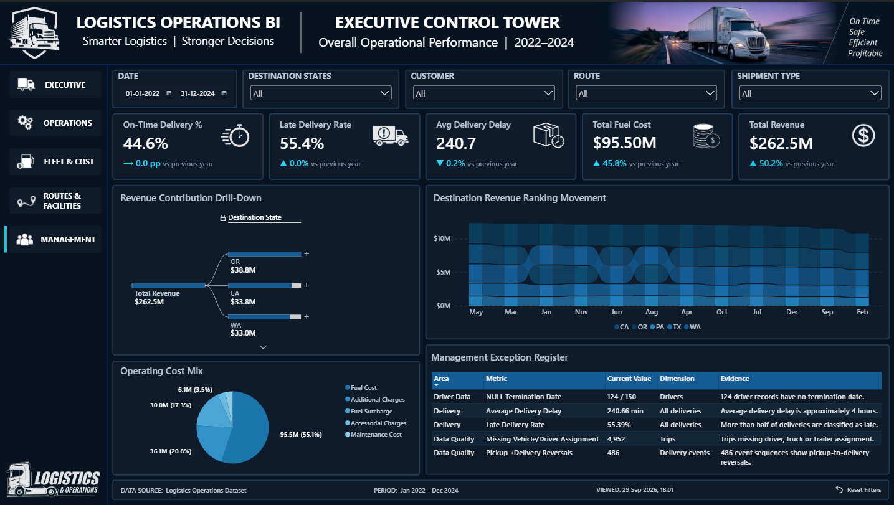

# Logistics Operations BI

### End-to-End Logistics Analytics, KPI Engineering & Power BI Reporting

A portfolio-grade **Data Analytics and Business Intelligence project** built to analyze logistics operations across **loads, trips, delivery performance, fleet utilization, fuel consumption, operating costs, routes, and facilities**.

The project follows a complete analytical workflow:

> **Dataset Audit → Data Validation → Business Analysis → KPI Design → Power Query → Data Modeling → DAX → KPI Validation → Power BI → Management Findings**

The focus is not simply on building a dashboard. The project evaluates **whether metrics are valid, what population and grain they represent, how they behave within the model, and what limitations must be disclosed before using them for business interpretation.**

---

## Dashboard

The final Power BI solution contains five analytical pages.

### 01 — Executive Control Tower



### 02 — Operations Diagnostics



### 03 — Fleet, Fuel & Cost Intelligence



### 04 — Route & Facility Intelligence



### 05 — Management Findings & Action



---

# 1. Business Problem

Logistics operations generate large volumes of transactional and operational data, but individual tables do not directly answer management questions.

This project was designed to turn that data into a structured analytical solution addressing:

* How much operational activity is being completed?
* What is the delivery-performance level?
* Where are delays occurring?
* How effectively is the fleet being utilized?
* What are the fuel-consumption and fuel-cost patterns?
* How are revenue and activity distributed across routes?
* What operational patterns are visible across facilities?
* Which metrics can be reliably used for management reporting?
* Where does the source data limit the conclusions that can be drawn?

The final solution therefore combines **business analysis, data validation, analytical modeling, and visualization** rather than treating Power BI as a standalone visualization exercise.

---

# 2. Data Scope

**Analytical period:** 01 January 2022 – 31 December 2024

The source dataset contains **14 operational tables** covering:

* Loads
* Trips
* Delivery Events
* Drivers
* Trucks
* Trailers
* Customers
* Facilities
* Routes
* Fuel Purchases
* Maintenance Records
* Safety Incidents
* Truck Utilization
* Driver Utilization

The original source files are retained under:

```text
data/raw/
```

The raw layer is treated as the immutable source population for the project.

---

# 3. Validated Performance Snapshot

The following values were reconciled against the implemented analytical model for the full 2022–2024 population.

| Metric                 |   Validated Value |
| ---------------------- | ----------------: |
| Completed Loads        |            85,410 |
| Completed Trips        |            85,410 |
| Total Revenue          |    262,525,800.29 |
| On-Time Delivery       |            44.61% |
| Active Fleet           |                92 |
| Total Fuel Consumption | 24,493,560.80 gal |
| Total Fuel Cost        |     95,499,723.14 |

These figures are **project validation baselines**, not external industry benchmarks or target values.

---

# 4. Key Analytical Findings

## Delivery Performance

The validated on-time delivery rate is **44.61%** under the project's documented delivery-event definition and tolerance.

The corresponding late-delivery population is approximately **55.39%**.

The project reports the observed performance without imposing an external service-level target that is not supported by the dataset or business requirements.

---

## Trip Asset Assignment Gaps

The dataset contains **4,952 trips with a missing driver, truck, and/or trailer assignment** across the three assignment fields.

The records were retained in the analytical population.

This matters because excluding incomplete assignments could change the denominator used for fleet, driver, or asset analysis and create a different population from the source data.

---

## Delivery-Event Chronology

Validation identified:

* **486 pickup-to-delivery chronology reversals**
* **0 dispatch-before-load cases**

The 486 reversals represent approximately **0.57% of the 85,410-load population**.

The affected records were retained and documented rather than arbitrarily corrected.

---

## Fuel Data Completeness

The dataset contains **196,442 fuel-purchase records**.

Within the fuel data:

* **3,880 records have no `truck_id`**
* **8,471 trips have no linked fuel-purchase record**

A missing fuel record is therefore **not interpreted as zero fuel consumption**.

This prevents missing linkage from being converted into a false operational conclusion.

---

## Fleet Utilization

The truck-utilization data contains **436 records above 100% utilization**.

These records were not capped at 100%.

The source values were retained so that the analytical model does not silently alter the underlying measurement.

---

## Metric-Grain Finding: Average Fuel Efficiency

Average Fuel Efficiency is sourced from the fleet-utilization metrics at their **source-defined utilization grain**.

As a result, load-level dimensions such as:

* Date
* State
* Customer
* Route
* Shipment Type

do not necessarily filter the utilization-metrics population.

The project therefore does not introduce unsupported relationships or DAX simply to force slicer responsiveness.

This is treated as a **metric-grain and modeling decision**, not as a dashboard defect.

---

# 5. KPI Framework

The KPI design process reviewed **35 candidate metrics**.

| KPI Layer                      |  Count |
| ------------------------------ | -----: |
| P1 Production KPIs             |      9 |
| Baseline / Foundation Measures |     10 |
| Supporting KPIs                |     13 |
| Intentionally Deferred         |      3 |
| **Total Candidates**           | **35** |

### P1 Production KPIs

1. Completed Loads
2. Completed Trips
3. Total Revenue
4. On-Time Delivery %
5. Fleet Utilization %
6. Active Fleet Count
7. Total Fuel Consumption
8. Average Fuel Efficiency
9. Total Fuel Cost

The supporting KPI layer provides additional operational, financial, route, and fleet analysis.

---

# 6. KPI Decisions

Three candidate KPIs were deliberately deferred.

### Delivery Exception Rate

Deferred because the available data did not provide a sufficiently validated exception classification.

### Trips per Active Truck

Deferred because the available active-fleet population is not sufficiently aligned with the historical 2022–2024 trip population to provide a defensible denominator.

### Maintenance Cost per Mile

Deferred because maintenance and trip-distance populations cannot be safely aligned across grain and time without introducing unsupported assumptions.

This reflects a core analytical principle used throughout the project:

> **A metric is not production-ready simply because it can be calculated.**

---

# 7. Analytical Workflow

## 7.1 Dataset Audit

The source data was profiled for:

* Table structure
* Record counts
* Data types
* Missing values
* Key fields
* Date coverage
* Referential consistency
* Assignment completeness
* Event chronology
* Potential analytical risks

Implementation and validation work is maintained under:

```text
analysis/01_dataset_audit/
```

---

## 7.2 Data Validation

Structural, population, and chronology checks were performed before finalizing the BI model.

Supporting work is maintained under:

```text
analysis/02_data_validation/
```

---

## 7.3 Business Analysis

The business-analysis layer translates the validated dataset into:

* Data-quality findings
* KPI analysis
* Operations findings
* Management findings

Supporting analysis is maintained under:

```text
analysis/03_business_analysis/
```

---

## 7.4 KPI Validation

Implemented KPIs were reconciled against validated source populations and documented baselines.

Supporting validation is maintained under:

```text
analysis/04_kpi_validation/
```

---

## 7.5 BI Engineering

Power Query, semantic modeling, DAX, filter behavior, KPI implementation, and report architecture are documented in:

```text
docs/04_bi_engineering.md
```

---

# 8. Power Query Architecture

Power Query is the production transformation and staging layer.

```text
power_query/
├── src/
├── stg/
└── val/
```

The production model uses the `stg_*` layer.

The architecture therefore separates:

```text
Raw Source
    ↓
Power Query Transformation / Staging
    ↓
Semantic Model
    ↓
DAX Measures
    ↓
Power BI Report
```

The project does not use Python as the production ETL pipeline.

Python and Jupyter are used for selected audit and validation activities.

---

# 9. Semantic Model

The implemented semantic model contains **13 active relationships** using controlled single-direction filtering.

Key modeling decisions include:

* Raw source data remains immutable.
* `stg_*` queries provide the production staging layer.
* No direct Facility → Load relationship.
* No ambiguous Driver ↔ Fuel Purchase relationship.
* No uncontrolled many-to-many relationships.
* Higher-grain utilization metrics remain at their source grain.
* Fleet-level metrics are not artificially forced into load-level filter behavior.

A customer-load validation test returned:

**85,410 rows**

which reconciles with the validated load population.

---

# 10. Power BI Report

The final report contains five pages.

### 01 — Executive Control Tower

Executive view of:

* Revenue
* Loads and trips
* Delivery performance
* Revenue concentration by lane
* Geographic activity

### 02 — Operations Diagnostics

Focuses on:

* Delivery performance
* Delivery delay
* Trip duration
* Distance
* Fuel cost
* Operational diagnostics

### 03 — Fleet, Fuel & Cost Intelligence

Focuses on:

* Fleet utilization
* Active fleet
* Fuel efficiency
* Fuel consumption
* Fuel cost
* Maintenance patterns

### 04 — Route & Facility Intelligence

Focuses on:

* Route performance
* Revenue concentration
* Facility activity
* Supporting operational KPIs
* Geographic network analysis

### 05 — Management Findings & Action

Consolidates the major findings from the analysis and presents management-oriented areas for further review.

---

# 11. Dashboard Design Standards

The report uses a consistent executive reporting system.

### KPI Cards

Power BI **Card (new)** visuals are used for KPI presentation.

Cards support:

* Primary metric
* Secondary comparison where analytically valid
* Period comparison
* Consistent formatting
* Controlled visual hierarchy

### Visual Standards

The report uses:

* Dark professional theme
* Consistent navigation
* Standardized page shell
* Controlled slicers
* Consistent typography and spacing
* Minimal decorative elements

The design deliberately avoids:

* Unsupported KPI thresholds
* Arbitrary target values
* Unsupported traffic-light classifications
* Forced slicer responsiveness
* Misleading multicolor KPI styling
* Decorative visuals without analytical purpose

---

# 12. Data Quality Treatment

| Validation Area                | Finding | Treatment                |
| ------------------------------ | ------: | ------------------------ |
| Missing trip asset assignments |   4,952 | Preserved and documented |
| Pickup → delivery reversals    |     486 | Preserved and documented |
| Dispatch-before-load           |       0 | No issue identified      |
| Utilization >100%              |     436 | Preserved; not capped    |
| Fuel records without truck ID  |   3,880 | Preserved                |
| Trips without fuel linkage     |   8,471 | Not interpreted as zero  |

The project prioritizes **traceability and analytical defensibility over cosmetic data cleanliness**.

---

# 13. Repository Structure

```text
logistics-operations-bi/
│
├── analysis/
│   ├── 01_dataset_audit/
│   │   ├── dataset_audit_analysis.py
│   │   ├── dataset_audit_validation.ipynb
│   │   └── dataset_audit.py
│   │
│   ├── 02_data_validation/
│   │   └── data_validation.ipynb
│   │
│   ├── 03_business_analysis/
│   │   ├── data_quality_findings.md
│   │   ├── kpi_analysis.md
│   │   ├── management_findings.md
│   │   ├── operations_findings.md
│   │   └── README.md
│   │
│   └── 04_kpi_validation/
│       └── kpi_validation.ipynb
│
├── data/
│   ├── raw/                                   # Source dataset — intentionally excluded from Git
│   │   ├── 14 raw source tables
│   │   └── DATABASE_SCHEMA.txt
│   ├── processed/                             # Local processed artifacts — intentionally excluded 
|   |   |                                        from Git
│   │   └── README.md
│   └── reference/
│       └── README.md
│
├── dax/
│   ├── measures/
│   └── model/
│
├── docs/
│   ├── 03_business_design.md
│   └── 04_bi_engineering.md
│
├── logs/
│   ├── dataset_audit/
│   └── project_runs/
│
├── power_query/
│   ├── src/
│   ├── stg/
│   └── val/
│
├── powerbi/
│   └── Logistics_Operations_PowerBI.pbix
│
├── dashboard_images/
│   ├── 01_executive_control_tower.png
│   ├── 02_operations_diagnostics.png
│   ├── 03_fleet_fuel_cost_intelligence.png
│   ├── 04_route_facility_intelligence.png
│   └── 05_management_findings_action.png
│
├── .gitignore
├── README.md
└── requirements.txt
```

---

# 14. Documentation Map

### Business Design

```text
docs/03_business_design.md
```

Documents:

* Business objectives
* Analytical themes
* KPI framework
* KPI definitions
* Business interpretation
* Report/page design
* Findings
* Analytical decisions

### BI Engineering

```text
docs/04_bi_engineering.md
```

Documents:

* Power Query implementation
* Staging architecture
* Semantic model
* Relationships
* DAX implementation
* KPI validation
* Filter behavior
* Engineering decisions
* Known limitations
* Final engineering closure

### Business Analysis

```text
analysis/03_business_analysis/
```

Contains:

* `data_quality_findings.md`
* `kpi_analysis.md`
* `operations_findings.md`
* `management_findings.md`

---

# 15. Technology Stack

| Technology           | Purpose                                       |
| -------------------- | --------------------------------------------- |
| **Power BI**         | Semantic model, DAX and reporting             |
| **Power Query**      | Transformation and staging                    |
| **DAX**              | KPI and analytical measures                   |
| **Microsoft Excel**  | Source-data inspection and analytical support |
| **Python**           | Dataset audit and selected validation         |
| **Jupyter Notebook** | Reproducible audit and KPI validation         |
| **Git / GitHub**     | Version control and portfolio presentation    |

---

# 16. How to Review the Project

For a complete review, follow the analytical flow:

### 1. Dashboard

Start with the five screenshots under:

```text
dashboard_images/
```

Then open the Power BI report:

```text
powerbi/Logistics_Operations_PowerBI.pbix
```

### 2. Business Analysis

Review:

```text
analysis/03_business_analysis/
```

This provides the detailed findings behind the report.

### 3. Data Audit & Validation

Review:

```text
analysis/01_dataset_audit/
analysis/02_data_validation/
analysis/04_kpi_validation/
```

These establish the data and KPI validation work behind the final model.

### 4. Business Design

Review:

```text
docs/03_business_design.md
```

This explains the business requirements, KPI framework, analytical themes, and report design.

### 5. BI Engineering

Review:

```text
docs/04_bi_engineering.md
```

This explains the transformation, semantic model, DAX, validation, filter behavior, engineering decisions, and documented limitations.

### 6. Implementation

Review:

```text
dax/
power_query/
powerbi/
```

This provides the implementation artifacts supporting the final report.

---

# 17. Skills Demonstrated

This project demonstrates practical experience across:

* Data profiling and audit
* Data-quality investigation
* Business problem translation
* KPI design
* Metric-grain analysis
* Data validation
* Power Query transformation
* Semantic data modeling
* DAX development
* KPI reconciliation
* Power BI dashboard development
* Operational analytics
* Management findings
* Analytical limitation management
* Documentation and BI engineering governance

A central principle throughout the project was:

> **Build the number only after establishing that the number is meaningful.**

That principle influenced the KPI framework, model architecture, validation process, filter behavior, and final reporting design.

---

# 18. Project Status

The business-design and BI-engineering stages are complete.

The repository contains:

* Audited source data
* Data-validation work
* Documented data-quality findings
* Finalized KPI framework
* Power Query transformation/staging
* Validated semantic model
* DAX measures
* KPI validation evidence
* Five-page Power BI report
* Management findings
* Documented engineering decisions
* Documented analytical limitations
* Dashboard screenshots for portfolio presentation

The result is a complete **Data Analytics / Business Intelligence case study** in which the dashboard is supported by the underlying audit, validation, business analysis, modeling, KPI engineering, and documentation work.

---
## Author

**Rahul Dixit**  
Data Analytics | Business Intelligence | Power BI

[LinkedIn](https://www.linkedin.com/in/rahul-dixit-04888b20a/) · [GitHub](https://github.com/rahuldixit01/logistics-operations-bi)